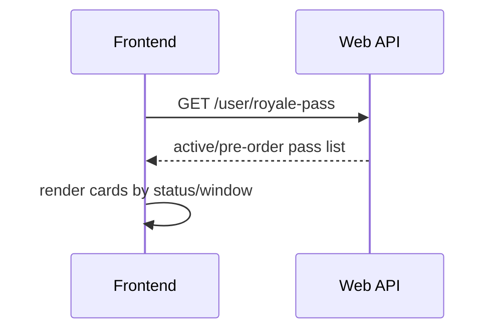
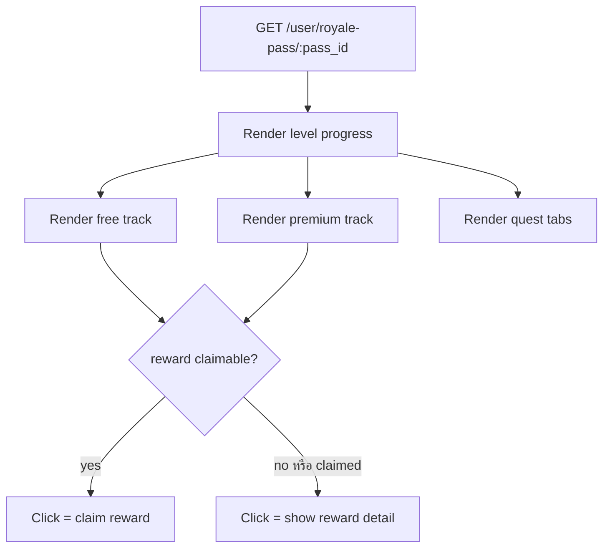

# Royale Pass Frontend Integration Guide

> เอกสารนี้ใช้สำหรับหน้า demo/frontend ที่ต้องเรียก API ปัจจุบันของ Royale Pass ถ้าต้องการรายละเอียดระบบทั้งหมดให้ดู `docs/royale-pass/README.md`

## เป้าหมาย UI

หน้า Royale Pass ควรแยกเป็น 3 ส่วนหลัก:

1. รายการ pass ที่ active/pre-order visible อยู่ทั้งหมด
2. หน้ารายละเอียด pass ที่แสดง progress level, free track, premium track และ reward detail รองรับ Responsive ในคอมเป็นแนวนอน ในมือถือเป็นแนวตั้ง
3. หน้า quest แยก tab ตาม scope ที่มี quest ใช้งานจริง: ทั้งหมด, รายวัน, รายสัปดาห์, ตลอดซีซั่น

## API Surface

| Method | Path | ใช้เมื่อ |
| --- | --- | --- |
| `GET` | `/user/royale-pass` | หน้า list pass |
| `GET` | `/user/royale-pass/:pass_id` | หน้า detail pass |
| `POST` | `/user/royale-pass/:pass_id/buy-premium/currency` | ซื้อ premium ด้วย coin |
| `POST` | `/user/royale-pass/:pass_id/reward/:level/:track/claim` | กดรับ reward |
| `POST` | `/book/:book_id/share` | user แชร์หนังสือ |

ไม่มี endpoint ซื้อ premium ด้วยเงินจริงในโปรเจคนี้ การซื้อเงินจริงต้องผ่าน payment project

## Flow หน้ารายการ Pass



ข้อมูลที่ควรแสดง:

| Field | ใช้แสดง |
| --- | --- |
| `pass_id` | key สำหรับเข้าหน้า detail |
| `name`, `description` | ชื่อและคำอธิบาย |
| `banner_img`, `pre_banner_img` | รูป banner |
| `start_date`, `end_date` | ระยะเวลา pass |
| `is_preorder_period` | ใช้แสดง badge pre-order |
| `user_state.current_level`, `user_state.current_exp` | สถานะของผู้ใช้ |
| `user_state.premium_status` | ป้าย premium/unlocked |

### การแสดง Pass ช่วง Pre-order

Pass จะถูกส่งมาใน `GET /user/royale-pass` ตั้งแต่ถึงเวลา `pre_countdown_date` แม้ `start_date` ยังไม่ถึง เพราะ backend ใช้เงื่อนไขแสดง pass ตั้งแต่ช่วง countdown/pre-order ได้

ให้ frontend ใช้ field เหล่านี้เพื่อแยก UI:

| Field | ใช้ทำอะไร |
| --- | --- |
| `is_preorder_period` | ถ้าเป็น `true` ให้แสดงสถานะ pre-order |
| `is_started` | ถ้าเป็น `false` หมายถึง pass ยังไม่เริ่มเล่น ทำ quest/claim reward ยังไม่ควรเปิด |
| `pre_countdown_date` | เวลาเริ่มแสดง pass ก่อนเปิดจริง |
| `start_date` | เวลาเริ่ม pass และเริ่มเล่น quest/reward |
| `end_date` | เวลาสิ้นสุด pass |
| `banner_img` | ในช่วง pre-order backend จะเลือก `pre_banner_img` แทนให้แล้วถ้ามี |
| `pre_banner_img` | รูป pre-order เฉพาะกิจ ใช้เป็น fallback/preview ได้ |

แนวทางแสดงผลบน card:

- ถ้า `is_preorder_period=true` ให้แสดง badge เช่น `Pre-order` หรือ `จองล่วงหน้า`
- แสดง countdown ไปยัง `start_date` เช่น `เริ่มใน 3 วัน`
- แสดงปุ่มซื้อ premium ได้ถ้า pass เปิดขายแล้ว แต่ปุ่มเข้าไปทำภารกิจ/รับ reward ควร disabled จนกว่า `is_started=true`
- ใช้ `banner_img` จาก response เป็นรูปหลักเสมอ เพราะ backend เลือกรูปตามช่วงเวลาให้แล้ว

เรื่องราคา:

- `GET /user/royale-pass` ตอนนี้ยังไม่มี `purchase_options` และยังไม่มี `preorder_payment_price` / `preorder_coin_price` ที่คำนวณแล้วในระดับ list
- ถ้า card หน้า list ต้องแสดงราคาหลังส่วนลด ให้ frontend เรียก `GET /user/royale-pass/:pass_id` ก่อนแสดงราคา หรือให้ backend เพิ่ม `purchase_options` ลงใน list response ภายหลัง
- `GET /user/royale-pass/:pass_id` มี `purchase_options.preorder_payment_price` และ `purchase_options.preorder_coin_price` ที่ backend คำนวณด้วย `Math.round` ให้แล้ว

## Flow หน้ารายละเอียด Pass



### Level progress

ควรแสดง:

| Field | ใช้แสดง |
| --- | --- |
| `current_level` | level ปัจจุบัน |
| `current_exp` | EXP สะสมปัจจุบัน |
| `level.required_exp` | EXP ที่ต้องมีเพื่อถึง level นั้น |
| `next_required_exp` หรือข้อมูล level ถัดไป | ทำ progress bar |
| `overflow`/repeat levels | ใช้แสดง level หลัง cap ถ้ามี overflow rule |

### Reward track

Reward หนึ่ง level อาจมีหลาย item ให้ frontend render เป็น stack/card ซ้อนกันได้

| Field | ใช้แสดง |
| --- | --- |
| `level` | level reward |
| `track` | `free` หรือ `premium` |
| `reward_type` | ประเภท reward |
| `reward_display_text` | ข้อความแสดงผล เช่น `คูปอง: ...` |
| `reward_image` | รูป reward ที่ backend resolve ให้ |
| `amount` | จำนวน reward |
| `is_claimable` | กดแล้วรับ reward ได้ |
| `is_claimed` | รับไปแล้ว |
| `coupon_detail` | รายละเอียด coupon ถ้า `reward_type=user_coupon` |

กติกา click:

- ถ้า `is_claimable=true` ให้ click เพื่อ claim
- ถ้า `is_claimable=false` หรือ `is_claimed=true` ให้ click เพื่อเปิดรายละเอียด reward
- ถ้า reward หลายชิ้นใน level เดียว ให้ modal แสดงรายการทั้งหมดใน level/track นั้น

## ซื้อ Premium ด้วย Coin

```http
POST /user/royale-pass/:pass_id/buy-premium/currency
Content-Type: application/json
Authorization: Bearer <token>

{
  "currency_type": "coin"
}
```

ปัจจุบัน schema รับเฉพาะ `coin` แม้ชื่อ field จะเปิดทางให้เพิ่ม currency type อื่นในอนาคต

### Purchase Options

ค่าที่ backend ส่งให้ frontend ใช้แสดงราคา:

| Field | ความหมาย |
| --- | --- |
| `payment_enabled` | pass นี้ซื้อเงินจริงได้หรือไม่ แต่ flow ทำใน payment project |
| `payment_price` | ราคาเงินจริงปกติจาก `royale_pass.premium_payment_price` |
| `coin_enabled` | pass นี้ซื้อด้วย coin ได้หรือไม่ |
| `coin_price` | ราคา coin ปกติ |
| `preorder_payment_discount_percent` | ส่วนลดเงินจริงช่วง pre-order |
| `preorder_coin_discount_percent` | ส่วนลด coin ช่วง pre-order |
| `preorder_payment_price` | ราคาหลังส่วนลดที่ backend คำนวณให้เพื่อแสดงผล |
| `preorder_coin_price` | ราคา coin หลังส่วนลดที่ backend คำนวณให้เพื่อแสดงผล |
| `preorder_bonus_level` | level ที่จะได้ทันทีหลังซื้อ premium ในช่วง pre-order |

ราคาหลังส่วนลดใช้ `Math.round(basePrice * (100 - discountPercent) / 100)`

## Claim Reward

```http
POST /user/royale-pass/:pass_id/reward/:level/:track/claim
Authorization: Bearer <token>
```

ตัวอย่าง:

```http
POST /user/royale-pass/1/reward/10/premium/claim
```

หลัง claim สำเร็จ backend จะส่ง socket `royale_pass:update` พร้อม `event_type=reward_claimed`

## Share Book

```http
POST /book/:book_id/share
Content-Type: application/json
Authorization: Bearer <token>

{
  "share_type": "copy_link"
}
```

การแชร์เล่มเดิมใน quest occurrence เดียวจะไม่นับซ้ำ เพราะ Royale Pass dedupe ด้วย `book_id` แต่ API share ยังสามารถบันทึก `user_shared_book` เพื่อเก็บประวัติ share ได้

## Quest UI

Quest tabs ควรแสดงเฉพาะ scope ที่มี active quest จริง

| Scope | Tab |
| --- | --- |
| `daily` | รายวัน |
| `weekly` | รายสัปดาห์ |
| `season` | ตลอดซีซั่น |

Field ที่ควรแสดงในรายการ quest:

| Field | ใช้แสดง |
| --- | --- |
| `name`, `description` | ชื่อและรายละเอียด quest |
| `scope` | ใช้จัด tab |
| `track` | free/premium |
| `target_value` | เป้าหมาย |
| `progress_value` | progress ปัจจุบัน |
| `exp_reward` | EXP ที่ได้เมื่อสำเร็จ |
| `is_completed` | สำเร็จแล้ว |
| `is_exp_granted` | รับ EXP แล้วหรือยัง |
| `occurrence_end_at` | หมดเวลาทำ quest occurrence นี้ |

## Socket

Subscribe event:

```text
royale_pass:update
```

Event ที่ reliable ตอนนี้:

| event_type | ควรทำอะไร |
| --- | --- |
| `quest_completed` | refresh quest progress หรือแสดงแจ้งเตือน quest สำเร็จ |
| `level_up` | refresh pass detail หรือ patch level/progress |
| `reward_claimed` | refresh reward state และแสดงรายการ reward ที่ได้รับ |

## Frontend Checklist

- แสดง pass ได้หลาย pass พร้อมกัน
- ซ่อน tab quest ที่ไม่มี quest active
- แสดง reward stack เมื่อ level เดียวมีหลาย reward
- แสดง `coupon_detail` สำหรับ `reward_type=user_coupon`
- แสดงรูป frame/gift/coupon จาก `reward_image`
- ปุ่ม claim ต้อง disabled เมื่อหมดเวลา pass หรือ reward ยังรับไม่ได้
- premium reward ต้องเห็นรายละเอียดได้ แม้ยังไม่ปลดล็อค premium
- หลัง action ที่เกี่ยวกับ quest ให้ refresh detail หากไม่ได้รับ socket `level_up`
- ไม่เรียก endpoint เติมเงินจริงในโปรเจคนี้
