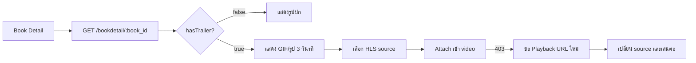

# Frontend: วิดีโอ Trailer ในหน้า Book Detail

Backend ส่ง source และ signed URL ส่วน Frontend ออกแบบ player, controls และ UX เอง

## สารบัญ

1. [สรุป](#สรุป)
2. [Flow](#flow)
3. [API](#api)
4. [ข้อมูลที่ต้องใช้](#ข้อมูลที่ต้องใช้)
5. [ข้อกำหนดของ Player](#ข้อกำหนดของ-player)
6. [Cache และ URL หมดอายุ](#cache-และ-url-หมดอายุ)
7. [Error และ UI State](#error-และ-ui-state)
8. [ตัวอย่าง Integration](#ตัวอย่าง-integration)
9. [Implementation Map](#implementation-map)
10. [Checklist](#checklist)

## สรุป

| หัวข้อ | รายละเอียด |
|---|---|
| API หลัก | `GET /bookdetail/:book_id` |
| รูปแบบหลัก | HLS |
| Player | Frontend ออกแบบเอง |
| Safari/iOS | ใช้ native HLS |
| Browser อื่น | ใช้ `hls.js` |
| Autoplay | เริ่มแบบ `muted` |
| อายุ URL | เริ่มต้น 300 วินาที |
| Refresh URL | `GET /video/trailers/:trailerId/playback` |

## Flow



### แสดง GIF/รูปก่อนวิดีโอ

เมื่อเปิดหน้า Book Detail ให้ทำตามลำดับนี้:

1. เลือกสื่อเริ่มต้นตามลำดับ `img_gif_full → img_gif → img_full → img`
2. แสดง GIF หรือรูปทันที
3. รอตาม `video.presentation.detailAutoplayDelayMs` ปัจจุบันคือ `3000` มิลลิวินาที
4. ตรวจ `video.trailer.hasTrailer`
5. หากมี trailer ให้ attach HLS source แล้วสลับไปแสดงวิดีโอ
6. หากไม่มี trailer หรือโหลดวิดีโอไม่สำเร็จ ให้แสดง GIF/รูปเดิมต่อ

ใช้ `video.presentation.detailStartsWith` เพื่อดูว่าสื่อเริ่มต้นเป็น `gif` หรือ `image`

ช่วง 3 วินาทีแรกไม่ควร attach HLS source หรือสร้าง `Hls` instance เพื่อไม่ให้โหลด manifest และ segment ก่อนจำเป็น

ตัวอย่าง state:

```ts
const delayMs = data.video.presentation.detailAutoplayDelayMs ?? 3000;
const canShowTrailer = data.video.trailer.hasTrailer;

setMediaMode("cover");

const timer = window.setTimeout(() => {
  if (canShowTrailer) setMediaMode("trailer");
}, delayMs);
```

ต้อง `clearTimeout(timer)` เมื่อเปลี่ยนหนังสือหรือ component unmount

## API

| Method | Path | ผู้เรียก | หน้าที่ |
|---|---|---|---|
| GET | `/bookdetail/:book_id` | Frontend | โหลดหนังสือและ trailer |
| GET | `/video/trailers/:trailerId/playback` | Frontend | ขอ signed URL ใหม่ |
| GET/HEAD | `/video/trailers/:trailerId/play/:expiresAt/:token/*` | Player | โหลด manifest และ segment |

Frontend ห้ามสร้าง token หรือประกอบ `/play/*` เอง

## ข้อมูลที่ต้องใช้

ข้อมูลอยู่ที่ `data.video`

```json
{
  "video": {
    "trailer": {
      "hasTrailer": true,
      "id": 38,
      "hlsUrl": "https://api.example.com/video/trailers/38/play/.../hls/master.m3u8",
      "expiresAt": 1781851050,
      "preferredSource": {
        "type": "hls",
        "mimeType": "application/vnd.apple.mpegurl",
        "url": "https://api.example.com/video/trailers/38/play/.../hls/master.m3u8",
        "isPreferred": true
      },
      "sources": [],
      "thumbnailUrl": null,
      "qualityLabel": "576p",
      "durationSeconds": 10.1,
      "width": 1028,
      "height": 576
    },
    "presentation": {
      "detailStartsWith": "image",
      "detailAutoplayDelayMs": 3000,
      "detailUsesTrailer": true,
      "listUsesTrailer": false
    }
  }
}
```

### Field สำคัญ

| Field | ใช้ทำอะไร |
|---|---|
| `hasTrailer` | แสดงหรือซ่อน player |
| `id` | ใช้ refresh URL |
| `preferredSource` | source แนะนำ |
| `sources` | source ที่ใช้ได้ |
| `hlsUrl` | fallback เมื่อหา source ไม่พบ |
| `expiresAt` | ตรวจอายุ signed URL |
| `durationSeconds` | แสดงระยะเวลา |
| `width`, `height` | คำนวณ aspect ratio |
| `qualityLabel` | แสดงคุณภาพ |
| `thumbnailUrl` | poster เมื่อมีค่า |
| `detailAutoplayDelayMs` | เวลาก่อนเปลี่ยนจากรูปเป็นวิดีโอ |

ลำดับเลือกรูปปก:

```text
img_gif_full → img_gif → img_full → img
```

ลำดับเลือก source:

```text
preferredSource → HLS ใน sources → hlsUrl
```

## ข้อกำหนดของ Player

Frontend ต้องจัดการ:

- Play, pause, seek, volume, mute และ fullscreen
- Loading, buffering, ready และ error
- Native HLS หรือ `hls.js`
- Refresh URL และ resume เวลาเดิม
- Cleanup เมื่อเปลี่ยนหนังสือหรือ unmount
- Keyboard และ accessibility

### ข้อมูลที่ยังไม่มี

- `thumbnailUrl` ปัจจุบันเป็น `null`
- ไม่มี subtitle/caption
- ไม่มี MP4 fallback
- `sources` ใช้ HLS เป็นหลัก
- Backend ไม่เก็บ watch progress
- Backend ไม่กำหนด analytics event ของ player

ใช้รูปปกเป็น poster เมื่อ `thumbnailUrl` ไม่มีค่า

### Autoplay

ใช้:

```tsx
<video muted playsInline autoPlay />
```

Browser ส่วนใหญ่บล็อก autoplay แบบเปิดเสียง เปิดเสียงหลังผู้ใช้กดเท่านั้น

หากไม่ autoplay ให้ใช้ `preload="metadata"`

## Cache และ URL หมดอายุ

Cache ได้:

- ข้อมูลหนังสือและรูปปก
- `id`, `hasTrailer`
- `durationSeconds`, `width`, `height`
- `video.presentation`

ต้องตรวจ `expiresAt` ก่อนใช้:

- `hlsUrl`
- `dashUrl`
- URL ใน `sources`
- URL จาก playback refresh API

```ts
function isPlaybackUrlUsable(expiresAt?: number | null) {
  if (!expiresAt) return false;
  return expiresAt > Math.floor(Date.now() / 1000) + 30;
}
```

Refresh URL เมื่อ:

- เหลืออายุน้อยกว่า 30 วินาที
- manifest หรือ segment ตอบ `403`
- กลับจาก background แล้ว URL หมดอายุ

Resume flow:

1. เก็บ `currentTime` และสถานะเล่น
2. เรียก `/video/trailers/:trailerId/playback`
3. เปลี่ยน source
4. รอ metadata
5. ตั้งเวลาเดิมและเล่นต่อ

Retry refresh ไม่เกินหนึ่งครั้งต่อ error

ห้ามเก็บ signed URL ระยะยาวใน:

- `localStorage`
- IndexedDB
- Service Worker Cache Storage
- shared CDN cache

หากใช้ React Query/SWR ให้แยก cache ตามผู้ใช้:

```ts
["book-detail", bookId, userId ?? "guest"]
```

Service Worker ต้อง bypass:

```ts
/^\/video\/trailers\/[^/]+\/play\//
```

Backend cache media:

- Manifest: private สูงสุด 30 วินาทีและ revalidate
- Segment: private immutable ไม่เกินอายุ token

## Error และ UI State

### UI State

| State | UI แนะนำ |
|---|---|
| ไม่มี trailer | รูปปก |
| Loading | Spinner |
| Ready | Poster และปุ่ม Play |
| Playing | Player controls |
| Buffering | Loading overlay |
| Unsupported | แจ้ง browser ไม่รองรับ |
| Error | Retry หรือกลับไปใช้รูปปก |

### Error

| HTTP/Condition | การจัดการ |
|---|---|
| `400` | หยุดเล่นและบันทึก error |
| `403` | Refresh URL หนึ่งครั้ง หากยังล้มเหลวให้ตรวจ origin |
| `404` | โหลด Book Detail ใหม่ |
| `429` | หยุด retry ชั่วคราว |
| `500` | แสดงปุ่ม Retry |
| Network error | `hls.startLoad()` |
| Media error | `hls.recoverMediaError()` |

Production origin ต้องอยู่ใน `VIDEO_ALLOWED_ORIGINS`

## ตัวอย่าง Integration

```tsx
import Hls from "hls.js";
import { useEffect, useRef } from "react";

type Trailer = {
  id: number;
  hasTrailer: boolean;
  hlsUrl?: string | null;
  thumbnailUrl?: string | null;
  preferredSource?: { url: string } | null;
  sources?: Array<{ type: string; url: string }>;
};

type Props = {
  trailer: Trailer;
  poster?: string;
};

function getSource(trailer: Trailer) {
  return (
    trailer.preferredSource?.url ||
    trailer.sources?.find((item) => item.type === "hls")?.url ||
    trailer.hlsUrl ||
    null
  );
}

export function BookTrailer({ trailer, poster }: Props) {
  const ref = useRef<HTMLVideoElement>(null);

  useEffect(() => {
    const video = ref.current;
    const source = getSource(trailer);
    if (!video || !trailer.hasTrailer || !source) return;

    let hls: Hls | null = null;

    if (video.canPlayType("application/vnd.apple.mpegurl")) {
      video.src = source;
    } else if (Hls.isSupported()) {
      hls = new Hls({ enableWorker: true, backBufferLength: 30 });
      hls.loadSource(source);
      hls.attachMedia(video);
    }

    return () => {
      hls?.destroy();
      video.pause();
      video.removeAttribute("src");
      video.load();
    };
  }, [trailer]);

  if (!trailer.hasTrailer) return null;

  return (
    <video
      ref={ref}
      controls
      muted
      playsInline
      preload="metadata"
      poster={trailer.thumbnailUrl || poster}
    />
  );
}
```

ตัวอย่างนี้แสดงเฉพาะการ attach source ต้องเพิ่ม refresh URL และ error handling ก่อนใช้จริง

## Implementation Map

| ส่วน | ไฟล์ |
|---|---|
| Book Detail payload | `src/services/book/book_detail.service.ts` |
| Playback routes | `src/routes/video/video_trailer.route.ts` |
| Playback controller | `src/controllers/video/video_trailer.controller.ts` |
| Token และ URL | `src/lib/video_playback.ts` |
| Playback service | `src/services/video/video_trailer.service.ts` |
| Config | `src/config/video.config.ts` |

## Checklist

- [ ] อ่าน trailer จาก `/bookdetail/:book_id`
- [ ] แสดง GIF/รูปก่อนตามลำดับ fallback
- [ ] รอ `detailAutoplayDelayMs` ก่อนแสดง trailer
- [ ] ไม่ attach HLS ระหว่างช่วงแสดง GIF/รูป
- [ ] แสดงรูปปกเมื่อไม่มี trailer
- [ ] รองรับ native HLS และ `hls.js`
- [ ] ใช้ `muted` และ `playsInline` เมื่อ autoplay
- [ ] ตรวจ `expiresAt` ก่อนใช้ URL จาก cache
- [ ] Refresh เมื่อได้ `403`
- [ ] Resume จากเวลาเดิม
- [ ] หยุด retry เมื่อได้ `404`/`429`
- [ ] Cleanup player เมื่อ unmount
- [ ] ไม่เก็บ signed URL ระยะยาว
- [ ] มี unsupported และ error state
