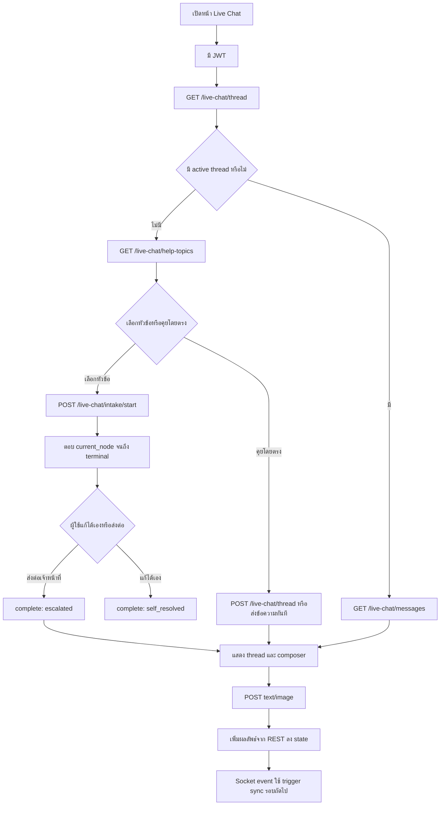
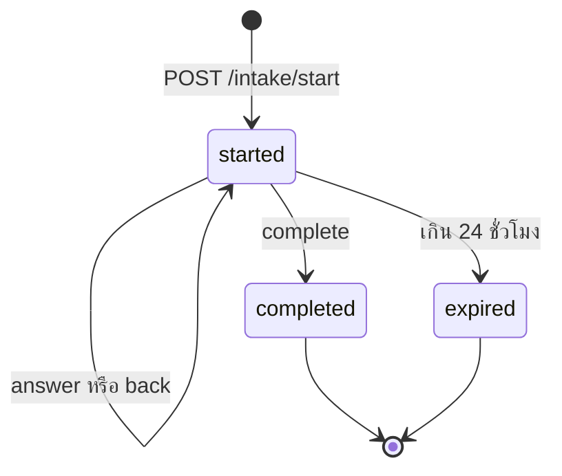
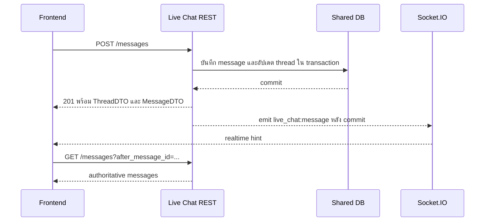

# Live Chat Web Frontend Integration Guide

เอกสารนี้อธิบายการเชื่อมต่อ Live Chat จากหน้าเว็บกับ `enjoybook_web_api` โดยอ้างอิง implementation ณ วันที่ 16 กรกฎาคม 2026

กลุ่มผู้อ่านหลักคือ Frontend Engineer และ QA ที่ต้องทำหน้ารายการบทสนทนา ห้องแชต แบบคัดกรองปัญหา และแบบประเมินหลังจบเคส

## สารบัญ

1. [สรุปภาพรวม TLDR](#สรุปภาพรวม-tldr)
2. [ขอบเขตและหน้าที่ของ Frontend](#ขอบเขตและหน้าที่ของ-frontend)
3. [Flow การใช้งาน](#flow-การใช้งาน)
4. [การเชื่อมต่อและ Authentication](#การเชื่อมต่อและ-authentication)
5. [รูปแบบ Response กลาง](#รูปแบบ-response-กลาง)
6. [Data contracts ที่ใช้ซ้ำ](#data-contracts-ที่ใช้ซ้ำ)
7. [API quick reference](#api-quick-reference)
8. [รายละเอียด API](#รายละเอียด-api)
9. [Pagination และการ Sync](#pagination-และการ-sync)
10. [SocketIO Realtime](#socketio-realtime)
11. [UI state ที่แนะนำ](#ui-state-ที่แนะนำ)
12. [Error handling](#error-handling)
13. [Validation checklist](#validation-checklist)
14. [Implementation map](#implementation-map)
15. [ข้อควรระวังและสิ่งที่ต้องตรวจสอบเพิ่ม](#ข้อควรระวังและสิ่งที่ต้องตรวจสอบเพิ่ม)

## สรุปภาพรวม TLDR

| หัวข้อ | รายละเอียด |
|---|---|
| Base path | `/live-chat` |
| ผู้ใช้งาน API | ผู้ใช้ที่ login แล้วเท่านั้น ทุก endpoint ตรวจ JWT |
| งานหลัก | ดูประวัติ สร้างห้อง ส่งข้อความ/รูป ทำแบบคัดกรอง อ่านสถานะ และส่ง feedback |
| Source of truth | REST API และฐานข้อมูล ส่วน Socket.IO เป็นสัญญาณให้ client sync |
| Thread status | `active`, `resolved`, `archived` |
| Message type | `text`, `image` |
| Intake status | `started`, `completed`, `expired` และหมดอายุใน 24 ชั่วโมง |
| Intake outcome | `skip`, `self_resolved`, `escalated` |
| Feedback | ส่งได้เมื่อเคส `resolved` มี resolution และยังไม่เกิน 7 วัน |
| Pagination | Cursor ด้วย `before_*_id` และ `after_message_id`; ไม่ใช้เลขหน้า |
| Realtime events | `live_chat:message`, `live_chat:read`, `thread_resolved` |
| LINE notification | ปิดอยู่ด้วย `LIVE_CHAT_LINE_NOTIFY=false`; Frontend ไม่ต้องรองรับ Outbox |
| รูปภาพ | `jpg`, `jpeg`, `png`, `webp`, `gif` ขนาดไม่เกิน 5 MB |

## ขอบเขตและหน้าที่ของ Frontend

Frontend ต้องรับผิดชอบ:

- แนบ JWT ใน `Authorization` ทุก HTTP request
- จัดการ thread ปัจจุบันและประวัติ thread แยกกัน
- แสดงข้อความตาม `message_type` และ `sender_type`
- เก็บ cursor ล่าสุดสำหรับโหลดข้อความเก่าและ sync ข้อความใหม่
- ใช้ `can_send` เป็นตัวตัดสินว่า composer ควรเปิดหรือปิด
- ใช้ `current_node`, `terminal` และ `outcome` คุมหน้าจอ decision tree
- ฟัง Socket.IO เพื่อ trigger การ sync แต่ต้องกู้สถานะจาก REST หลัง reconnect
- แสดง error ตาม HTTP status และ `error_code`

Frontend ไม่ต้องรับผิดชอบ:

- สร้างหรือแก้สถานะ thread เอง
- ตัดสินว่า feedback ยังส่งได้หรือไม่ ให้ใช้ `feedback_eligible`
- สร้าง URL รูปหลัง upload ให้ใช้ `image_url` ที่ API คืนมา
- เชื่อถือ `user_id` จาก query string ของ Socket แทน JWT
- ติดต่อ LINE หรือใช้งาน `notification_outbox`
- ติดต่อ Admin API โดยตรง

## Flow การใช้งาน

### Flow หลักของหน้าจอ



### Lifecycle ของ Intake



กติกา outcome จาก implementation:

| รูปแบบ Intake | Outcome ที่ใช้ได้ | เงื่อนไข |
|---|---|---|
| เริ่มโดยไม่ส่ง topic | `skip`, `escalated` | ไม่มี decision tree |
| เริ่มด้วย topic | `self_resolved`, `escalated` | ต้องเดินถึง terminal ก่อน |
| Intake เดิม completed | outcome เดิมเรียกซ้ำได้ | outcome ต่างจากเดิมได้ `409` |

## การเชื่อมต่อและ Authentication

### HTTP headers

```http
Authorization: Bearer <JWT>
Content-Type: application/json
x-device-id: <device-id-if-used>
```

`x-device-id` ใช้ร่วมกับระบบ device revocation ของโปรเจกต์ หากหน้าเว็บมี device ID อยู่แล้วควรส่งค่าเดิมทุก request

ทุก endpoint ใต้ `/live-chat/*` ใช้ `authenticateLiveChatJWT` หาก token ไม่มี หมดอายุ ไม่ถูกต้อง บัญชีถูก block หรือ device ถูก revoke จะได้ canonical response `401`

### Fetch helper ตัวอย่าง

```ts
type ApiEnvelope<T> = {
  code: number;
  status: "success" | "error";
  message: string;
  data: T | null;
  error_code?: string;
  request_id?: string | null;
};

async function liveChatRequest<T>(
  apiOrigin: string,
  token: string,
  path: string,
  init: RequestInit = {},
): Promise<T> {
  const response = await fetch(`${apiOrigin}/live-chat${path}`, {
    ...init,
    headers: {
      Authorization: `Bearer ${token}`,
      ...(init.body instanceof FormData ? {} : { "Content-Type": "application/json" }),
      ...init.headers,
    },
  });

  const payload = (await response.json()) as ApiEnvelope<T>;
  if (!response.ok || payload.status !== "success" || payload.data === null) {
    throw { httpStatus: response.status, ...payload };
  }
  return payload.data;
}
```

อย่ากำหนด `Content-Type` เองเมื่อส่ง `FormData` เพราะ browser ต้องสร้าง multipart boundary

## รูปแบบ Response กลาง

### Success

```json
{
  "code": 200,
  "status": "success",
  "message": "",
  "data": {}
}
```

คำสั่งที่สร้าง resource อาจคืน `201` ทั้ง HTTP status และ `code` ส่วนคำสั่ง idempotent ที่พบ resource เดิมจะคืน `200`

### Known error

```json
{
  "code": 422,
  "status": "error",
  "error_code": "validation_error",
  "message": "Live Chat request validation failed",
  "data": {
    "issues": [
      { "path": "body", "message": "body must not be blank" }
    ]
  }
}
```

### Authentication error

```json
{
  "code": 401,
  "status": "error",
  "message": "Authentication required",
  "data": null
}
```

### Unexpected server error

```json
{
  "code": 500,
  "status": "error",
  "message": "Internal Server Error",
  "data": null,
  "request_id": "request-id-or-null"
}
```

เมื่อได้ `500` ควรเก็บ `request_id` เพื่อส่งให้ Backend ตรวจ log

## Data contracts ที่ใช้ซ้ำ

### ThreadDTO

```ts
type ThreadDTO = {
  thread_id: number;
  status: "active" | "resolved" | "archived";
  assigned_admin_id: number | null;
  last_message_id: number | null;
  last_message_at: string | null;
  last_user_message_at: string | null;
  last_admin_message_at: string | null;
  last_resolved_at: string | null;
  archived_at: string | null;
  can_send: boolean;
  intake_summary: IntakeDTO | null;
  resolution_summary: ResolutionSummary | null;
  feedback_eligible: boolean;
  feedback_summary: FeedbackDTO | null;
  created_at: string;
  updated_at: string;
};
```

วันที่ทั้งหมดเป็น ISO 8601 string หรือ `null` ให้ format timezone ที่ presentation layer

`can_send` เป็น `true` เฉพาะ thread ที่มีสถานะ `active`

### MessageDTO

```ts
type MessageDTO = {
  message_id: number;
  thread_id: number;
  sender_type: "user" | "admin" | "system";
  sender_user_id: number | null;
  sender_admin_id: number | null;
  message_type: "text" | "image";
  body: string;
  image_url?: string;
  created_at: string;
};
```

ถ้า `message_type === "image"` ค่า `body` เป็น URL และมี `image_url` ค่าเดียวกัน ให้ใช้ `image_url` สำหรับ ``

### IntakeDTO

```ts
type IntakeDTO = {
  intake_id: number;
  status: "started" | "completed" | "expired";
  outcome: "skip" | "self_resolved" | "escalated" | null;
  topic_code: string | null;
  topic_revision: number | null;
  topic_title: string | null;
  path: Array<{
    node_id: number;
    node_key: string;
    prompt: string;
    choice_id: number;
    choice_label: string;
  }>;
  current_node: null | {
    node_id: number;
    node_key: string;
    prompt: string;
    choices: Array<{
      choice_id: number;
      label: string;
      sort_order: number;
    }>;
  };
  terminal: null | {
    node_id: number;
    node_key: string;
    title: string;
    body: string;
    images: Array<{ image_url: string; sort_order: number }>;
  };
  terminal_images: Array<{ image_url: string; sort_order: number }>;
  expires_at: string;
};
```

การ render:

- ถ้า `current_node !== null` ให้แสดงคำถามและเรียง choice ด้วย `sort_order`
- ถ้า `terminal !== null` ให้แสดง `title`, `body`, `images`
- `path` คือคำตอบที่ยัง active หลังการย้อนกลับ
- อย่าเก็บ decision tree แยกเอง ให้แทน state ด้วย IntakeDTO ล่าสุดจาก API

### ResolutionSummary

```ts
type ResolutionSummary = {
  issue_type:
    | "technical" | "user_error" | "account" | "payment"
    | "content" | "policy" | "other";
  resolution_type:
    | "guided_user" | "fixed_system" | "data_corrected"
    | "configuration_changed" | "refund_or_compensation"
    | "explained_policy" | "escalated" | "no_action" | "other";
  resolved_at: string;
};
```

### FeedbackDTO

```ts
type FeedbackDTO = {
  rating: number;
  comment: string | null;
  source: "web";
  tags: string[];
  submitted_at: string;
  updated_at: string;
};
```

## API quick reference

| Method | Path | ใช้ทำอะไร | Success |
|---|---|---|---:|
| GET | `/live-chat/thread` | ดู active thread ปัจจุบัน | 200 |
| POST | `/live-chat/thread` | สร้าง active thread หากยังไม่มี | 200/201 |
| POST | `/live-chat/thread/new` | ปิดห้องเดิมและเริ่มห้องใหม่ | 200/201 |
| GET | `/live-chat/threads` | ดูประวัติ thread | 200 |
| GET | `/live-chat/messages` | ดูข้อความของ active thread | 200 |
| GET | `/live-chat/threads/:threadId/messages` | ดูข้อความของ thread ในประวัติ | 200 |
| POST | `/live-chat/messages` | ส่งข้อความ text | 201 |
| POST | `/live-chat/messages/image` | upload และส่งข้อความรูป | 201 |
| POST | `/live-chat/link-preview` | ดึง Open Graph สำหรับ URL ในข้อความ | 200 |
| PUT | `/live-chat/read` | เลื่อน read cursor ของผู้ใช้ | 200 |
| GET | `/live-chat/help-topics` | โหลดหัวข้อช่วยเหลือที่ publish | 200 |
| POST | `/live-chat/intake/start` | เริ่มหรือ resume intake | 200/201 |
| GET | `/live-chat/intake/:intakeId` | โหลด intake ล่าสุด | 200 |
| POST | `/live-chat/intake/:intakeId/answer` | ตอบคำถาม decision tree | 200 |
| POST | `/live-chat/intake/:intakeId/back` | ย้อนกลับไปคำถามก่อนหน้า | 200 |
| POST | `/live-chat/intake/:intakeId/complete` | จบ intake และอาจสร้าง thread | 200 |
| GET | `/live-chat/feedback/tags` | โหลด tag ที่ใช้ประเมิน | 200 |
| PUT | `/live-chat/threads/:threadId/feedback` | สร้างหรือแก้ feedback | 200 |

## รายละเอียด API

### โหลด active thread

`GET /live-chat/thread`

ใช้ตอนเปิดหน้า Live Chat เพื่อดูว่าผู้ใช้มีห้องที่กำลังใช้งานหรือไม่

ผลลัพธ์เมื่อมีห้อง:

```json
{
  "thread": {
    "thread_id": 120,
    "status": "active",
    "can_send": true,
    "last_message_id": 450,
    "intake_summary": null,
    "resolution_summary": null,
    "feedback_eligible": false,
    "feedback_summary": null
  }
}
```

ตัวอย่างย่อแสดงเฉพาะ field สำคัญ response จริงใช้ ThreadDTO เต็ม

เมื่อไม่มี active thread:

```json
{ "thread": null }
```

### สร้าง active thread หากยังไม่มี

`POST /live-chat/thread`

ไม่ต้องส่ง body

- สร้างใหม่: `201`, `{ "thread": ThreadDTO, "created": true }`
- มี active thread อยู่แล้ว: `200`, `{ "thread": ThreadDTO, "created": false }`

ใช้ endpoint นี้เมื่อ UI ต้องมี `thread_id` ก่อนเปิด composer ทั้งนี้ `POST /messages` สามารถสร้าง active thread ให้อัตโนมัติได้

### เริ่ม thread ใหม่

`POST /live-chat/thread/new`

ไม่ต้องส่ง body

ผลลัพธ์:

```ts
{
  previous_thread_id: number | null;
  thread: ThreadDTO;
  created: boolean;
}
```

พฤติกรรม:

- ถ้า active thread เดิมยังไม่มีข้อความ จะคืนห้องเดิมด้วย `200` และ `created: false`
- ถ้ามีข้อความแล้ว จะ archive ห้องเดิม สร้างห้องใหม่ และคืน `201`
- UI ควรย้ายห้องเก่าไป history เมื่อ `previous_thread_id` ไม่เป็น `null`

### โหลดประวัติ thread

`GET /live-chat/threads?limit=30&before_thread_id=120`

Query:

| Field | ค่าเริ่มต้น | Validation | ความหมาย |
|---|---:|---|---|
| `limit` | 30 | integer 1-100 | จำนวนรายการต่อครั้ง |
| `before_thread_id` | ไม่ส่ง | positive integer | โหลด thread ID ที่เก่ากว่า cursor |

ผลลัพธ์:

```ts
{
  threads: ThreadDTO[];
  next_before_thread_id: number | null;
  has_more: boolean;
}
```

รายการเรียงจาก `thread_id` ใหม่ไปเก่า

### โหลดข้อความของ active thread

`GET /live-chat/messages?limit=30`

ถ้าไม่มี active thread จะได้:

```json
{
  "thread": null,
  "messages": [],
  "next_before_message_id": null,
  "next_after_message_id": null,
  "has_more": false
}
```

ถ้ามี thread รูปแบบผลลัพธ์คือ:

```ts
{
  thread: ThreadDTO;
  messages: MessageDTO[];
  next_before_message_id: number | null;
  next_after_message_id: number | null;
  has_more: boolean;
}
```

ข้อความใน response เรียงเก่าไปใหม่เพื่อ append ลง timeline ได้โดยตรง

### โหลดข้อความของ thread ในประวัติ

`GET /live-chat/threads/:threadId/messages?limit=30`

ใช้รูปแบบ query และ response เหมือน `GET /live-chat/messages` แต่สามารถอ่าน thread ที่ `resolved` หรือ `archived` ได้

API ตรวจ ownership จาก JWT หาก ID ไม่ใช่ของผู้ใช้จะคืน `thread_not_found` โดยไม่เปิดเผยว่าห้องมีอยู่จริงหรือไม่

### ส่งข้อความ Text

`POST /live-chat/messages`

Request:

```json
{ "body": "ต้องการสอบถามเรื่องการชำระเงิน" }
```

Validation:

- `body` เป็น string ที่ trim แล้วต้องไม่ว่าง
- ความยาวสูงสุด 5,000 ตัวอักษร
- API เก็บข้อความต้นฉบับ ไม่ trim ข้อความก่อนบันทึก

ผลลัพธ์ `201`:

```ts
{
  thread: ThreadDTO;
  message: MessageDTO;
}
```

ถ้ายังไม่มี active thread API จะสร้างให้ใน transaction เดียวกับข้อความ

### ส่งข้อความรูปภาพ

`POST /live-chat/messages/image`

ส่ง `multipart/form-data` โดยใช้ field `image` แนะนำ หรือ `file` ซึ่ง backend รองรับเช่นกัน

```ts
const form = new FormData();
form.append("image", file);

const data = await liveChatRequest<{ thread: ThreadDTO; message: MessageDTO }>(
  apiOrigin,
  token,
  "/messages/image",
  { method: "POST", body: form },
);
```

Validation:

- MIME: `image/jpeg`, `image/png`, `image/webp`, `image/gif`
- Extension: `jpg`, `jpeg`, `png`, `webp`, `gif`
- ขนาดมากกว่า 0 และไม่เกิน 5 MB

API upload ไป MinIO ก่อนบันทึกข้อความ ผลลัพธ์เป็น MessageDTO ที่มี `message_type: "image"` และ `image_url`

### แสดงพรีวิวลิงก์

`POST /live-chat/link-preview`

เรียกเมื่อข้อความ `text` มี URL แบบ `http://` หรือ `https://` โดยทั่วไปให้เลือก URL แรกของข้อความ ไม่ต้องเปลี่ยน `message_type` และไม่ต้องบันทึก metadata ลงตารางข้อความ

Request:

```json
{ "url": "https://example.com/article" }
```

ผลลัพธ์เมื่อหน้าเว็บมี Open Graph หรือ metadata ที่ใช้แสดงผลได้:

```json
{
  "preview": {
    "url": "https://example.com/article",
    "site_name": "Example",
    "title": "Article title",
    "description": "Article description",
    "image_url": "https://example.com/cover.jpg"
  }
}
```

หากเว็บไม่มี metadata, content ไม่ใช่ HTML, timeout หรือปิดกั้น bot API จะตอบ `200` พร้อม `{ "preview": null }` เพื่อให้หน้าแชทยังคงแสดงลิงก์ธรรมดาได้

ข้อกำหนด:

- endpoint ต้องใช้ JWT ของ Live Chat
- รับเฉพาะ HTTP/HTTPS ความยาวไม่เกิน 2,048 ตัวอักษร
- API จำกัด redirect, timeout และขนาด HTML
- API ปิดกั้น loopback, private IP, link-local และ internal hostname เพื่อป้องกัน SSRF
- YouTube และ TikTok ใช้ official oEmbed ก่อน แล้วจึง fallback ไปอ่าน Open Graph จาก HTML
- rich preview ที่สำเร็จ cache ใน Redis 1 ชั่วโมง ส่วนผลที่ดึงไม่ได้ cache 2 นาทีเพื่อให้ลองใหม่ได้เร็ว
- frontend ควรใส่ `rel="noopener noreferrer"` และ `referrerPolicy="no-referrer"` สำหรับรูปจากเว็บภายนอก
- หาก `preview` เป็น `null` ควรแสดง compact link card จาก hostname แทนพื้นที่ rich preview ว่าง

### อัปเดต read cursor

`PUT /live-chat/read`

Request:

```json
{ "last_read_message_id": 450 }
```

ผลลัพธ์:

```json
{
  "read_state": {
    "thread_id": 120,
    "reader_type": "user",
    "reader_user_id": 99,
    "last_read_message_id": 450,
    "last_read_at": "2026-07-16T10:00:00.000Z"
  }
}
```

ข้อกำหนด:

- Message ID ต้องอยู่ใน active thread ของผู้ใช้
- ส่ง ID เดิมซ้ำได้
- ห้ามส่ง ID ที่ต่ำกว่า cursor ปัจจุบัน จะได้ `validation_error`
- ควรเรียกเมื่อข้อความอยู่ใน viewport หรือผู้ใช้เปิดห้อง ไม่ควรเรียกทุก render

### โหลดหัวข้อช่วยเหลือ

`GET /live-chat/help-topics`

ผลลัพธ์:

```json
{
  "topics": [
    {
      "topic_id": 1,
      "code": "payment_problem",
      "revision": 3,
      "title": "ปัญหาการชำระเงิน",
      "sort_order": 10
    }
  ]
}
```

ให้ส่งทั้ง `topic_id` และ `revision` ที่ได้กลับไปตอน start เพื่อยึด decision tree revision เดียวกัน

### เริ่มหรือ Resume Intake

`POST /live-chat/intake/start`

เริ่มด้วย topic:

```json
{ "topic_id": 1, "revision": 3 }
```

เริ่มโดยไม่เลือก topic:

```json
{}
```

ห้ามส่งเพียง field เดียวจาก `topic_id` และ `revision`

ผลลัพธ์:

```ts
{
  intake: IntakeDTO;
  created: boolean;
}
```

- Intake ใหม่คืน `201` และ `created: true`
- Intake `started` ของ topic revision เดิมที่ยังไม่หมดอายุคืน `200` และ `created: false`
- Intake มีอายุ 24 ชั่วโมงนับจากเวลาสร้าง

### โหลด Intake

`GET /live-chat/intake/:intakeId`

ผลลัพธ์ `{ "intake": IntakeDTO }`

หาก intake หมดอายุระหว่างใช้งาน API จะเปลี่ยนสถานะเป็น `expired` แล้วคืน `intake_expired` สถานะ `409`

### ตอบคำถาม Intake

`POST /live-chat/intake/:intakeId/answer`

Request:

```json
{ "node_id": 101, "choice_id": 1002 }
```

ใช้ `node_id` จาก `current_node.node_id` และ `choice_id` จาก `current_node.choices`

ผลลัพธ์ `{ "intake": IntakeDTO }` โดยอาจได้คำถามถัดไปใน `current_node` หรือคำตอบสุดท้ายใน `terminal`

การ retry คำตอบเดิมที่บันทึกแล้วเป็น idempotent แต่การส่ง choice อื่นจาก node เก่าจะได้ `intake_state_conflict`

### ย้อนกลับใน Intake

`POST /live-chat/intake/:intakeId/back`

Request:

```json
{ "node_id": 101 }
```

`node_id` ต้องเป็น question ที่อยู่ใน `path` ปัจจุบัน หรือเป็น current node

ผลลัพธ์ `{ "intake": IntakeDTO }` Backend จะ retract step ตั้งแต่จุดที่ย้อนกลับ ไม่ลบประวัติทางกายภาพ

### จบ Intake

`POST /live-chat/intake/:intakeId/complete`

Request:

```json
{ "outcome": "escalated" }
```

ผลลัพธ์:

```ts
{
  intake: IntakeDTO;
  thread: ThreadDTO | null;
}
```

- `escalated` สร้างหรือคืน active thread ใน `thread`
- `self_resolved` และ `skip` คืน `thread: null`
- เรียกซ้ำด้วย outcome เดิมได้
- Intake ที่มี topic ต้องเดินถึง `terminal` ก่อน complete

### โหลด Feedback tags

`GET /live-chat/feedback/tags`

ผลลัพธ์:

```json
{
  "tags": [
    {
      "key": "helpful",
      "label_th": "ช่วยแก้ปัญหาได้",
      "label_en": "Helpful",
      "sort_order": 10
    }
  ]
}
```

ให้ส่งค่า `key` กลับไปใน `tags` อย่าส่ง label

### สร้างหรือแก้ Feedback

`PUT /live-chat/threads/:threadId/feedback`

Request:

```json
{
  "rating": 5,
  "comment": "ได้รับคำตอบชัดเจน",
  "tags": ["helpful"]
}
```

Validation:

- `rating` เป็น integer 1-5
- `comment` ไม่เกิน 2,000 ตัวอักษร; ค่าว่างถูกแปลงเป็น `null`
- `tags` ไม่เกิน 7 ค่า ห้ามซ้ำ และแต่ละค่าต้องเป็น active tag

ผลลัพธ์ `{ "feedback": FeedbackDTO }`

การเรียกซ้ำเป็นการแก้ feedback เดิมและแทนที่รายการ tags ทั้งชุด

## Pagination และการ Sync

### โหลดข้อความเก่า

1. เรียก `GET /messages?limit=30`
2. เก็บ `next_before_message_id`
3. เมื่อ scroll ถึงด้านบน เรียก `GET /messages?limit=30&before_message_id=<cursor>`
4. prepend `messages` หน้าเก่า โดย dedupe ด้วย `message_id`
5. หยุดเมื่อ `has_more === false`

### โหลดข้อความใหม่หลัง reconnect

1. เก็บ message ID สูงสุดที่ client มี
2. เรียก `GET /messages?limit=100&after_message_id=<max-id>`
3. append ผลลัพธ์และ dedupe ด้วย `message_id`
4. ถ้า `has_more === true` ให้เรียกต่อด้วย `next_after_message_id`

ห้ามส่ง `before_message_id` และ `after_message_id` พร้อมกัน เพราะจะได้ `validation_error`

### ข้อสังเกตเกี่ยวกับ cursor

- `next_after_message_id` คือ message ID ท้ายสุดใน response
- `next_before_message_id` ใช้โหลดหน้าที่เก่ากว่า
- Response ของ message เรียงเวลาเก่าไปใหม่ทั้ง initial, before และ after
- Threads เรียงใหม่ไปเก่า และใช้ `next_before_thread_id` เท่านั้น

## SocketIO Realtime

Socket.IO เชื่อมต่อที่ origin เดียวกับ API ผ่าน root namespace และ default Socket.IO path

```ts
import { io } from "socket.io-client";

const socket = io(apiOrigin, {
  auth: { token: `Bearer ${token}` },
  transports: ["websocket", "polling"],
});
```

ไม่จำเป็นต้องส่ง `user_id` ใน query หากส่ง query มา ค่าต้องตรงกับ user ใน JWT จึงจะเข้าห้อง `live_chat:user:<userId>` ได้

Socket ที่ไม่มี token อาจเชื่อมต่อ transport สำเร็จ แต่จะไม่เข้าห้อง Live Chat และจะไม่ได้ Live Chat events

### Events

| Event | เกิดเมื่อ | สิ่งที่ Frontend ควรทำ |
|---|---|---|
| `live_chat:message` | มีข้อความใหม่จาก Web API หรือ App/Admin | sync messages ด้วย REST |
| `live_chat:read` | read state เปลี่ยน | sync/readjust read state ตาม UI |
| `thread_resolved` | ฝั่ง App/Admin resolve thread | reload thread และเปิด feedback UI ถ้า eligible |

Payload ของ event อาจเป็นแบบเต็มเมื่อเหตุการณ์เกิดจาก Web API หรือแบบ hint เมื่อ bridge มาจากระบบอื่น

ตัวอย่าง message hint ขั้นต่ำ:

```json
{
  "event_type": "message_created",
  "thread_id": 120,
  "message_id": 451,
  "sender_type": "admin",
  "created_at": "2026-07-16T10:05:00.000Z"
}
```

ตัวอย่าง resolved:

```json
{
  "thread_id": 120,
  "resolved_at": "2026-07-16T11:00:00.000Z"
}
```

### REST และ Socket ทำงานร่วมกัน



หลัง `connect`, `reconnect` หรือกลับมาจาก offline ให้ sync REST เสมอ เพราะ client events ไม่มีระบบ replay

## UI state ที่แนะนำ

```ts
type LiveChatViewState = {
  activeThread: ThreadDTO | null;
  threadHistory: ThreadDTO[];
  messagesByThread: Record<number, MessageDTO[]>;
  intake: IntakeDTO | null;
  beforeMessageCursor: number | null;
  afterMessageCursor: number | null;
  hasOlderMessages: boolean;
  connectionState: "connecting" | "online" | "offline";
  sendingText: boolean;
  uploadingImage: boolean;
  error: unknown | null;
};
```

กติกาการ update state:

- ใช้ `message_id` เป็น dedupe key
- ใช้ response จาก POST เป็น optimistic-confirmed result ไม่ต้องรอ Socket echo
- Socket echo ของข้อความตัวเองต้องไม่เพิ่มรายการซ้ำ
- เปลี่ยน `activeThread` ด้วย ThreadDTO ล่าสุดจากทุก mutation
- เมื่อ `thread_resolved` ให้ reload `/thread` และ `/threads`
- Disable composer เมื่อ `activeThread?.can_send !== true`
- ถ้าไม่มี active thread สามารถแสดง help topics หรือให้เริ่มแชตโดยตรง
- เก็บ upload progress ฝั่ง client แยกจาก MessageDTO เพราะ API ยังไม่มี progress endpoint

## Error handling

| HTTP | `error_code` | เกิดเมื่อ | แนวทางใน Frontend |
|---:|---|---|---|
| 401 | ไม่มี | JWT ใช้ไม่ได้ บัญชี block หรือ device ถูก revoke | ล้าง session/เปิด flow login ตามมาตรฐานโปรเจกต์ |
| 403 | `live_chat_forbidden` | JWT ไม่มี user ID ที่ถูกต้อง | หยุด request และรายงาน auth state ผิดปกติ |
| 404 | `thread_not_found` | ไม่พบ active/owned thread ตาม endpoint | reload `/thread` หรือกลับหน้า history |
| 404 | `message_not_found` | read cursor ชี้ message ที่ไม่อยู่ใน active thread | reload messages แล้วส่ง cursor ที่มีจริง |
| 404 | `help_topic_not_found` | topic/revision ไม่ published หรือ flow root ไม่มี | reload help topics |
| 404 | `intake_not_found` | intake ไม่มีหรือไม่ใช่ของผู้ใช้ | เริ่ม intake ใหม่ |
| 409 | `intake_expired` | Intake เกิน 24 ชั่วโมง | ปิด state เดิมและเริ่มใหม่ |
| 409 | `intake_state_conflict` | node/choice/back target ไม่ตรง active path | reload intake จาก GET แล้ว render ใหม่ |
| 409 | `intake_already_completed` | complete/แก้ intake ที่จบแล้วด้วย outcome ไม่ตรง | reload intake และใช้ outcome จาก server |
| 409 | `feedback_not_eligible` | thread ไม่ resolved ไม่มี resolution ถูก archive หรือเกิน 7 วัน | reload thread และซ่อน feedback form |
| 422 | `validation_error` | body/query/file/cursor ไม่ผ่าน schema | แสดง field error จาก `data.issues` ถ้ามี |
| 422 | `intake_outcome_invalid` | outcome ไม่ตรงชนิด intake หรือยังไม่ถึง terminal | reload intake และปิดปุ่ม outcome ที่ใช้ไม่ได้ |
| 422 | `feedback_tag_invalid` | tag ไม่ active | reload tags; `data.invalid_tags` ระบุค่าที่ผิด |
| 429 | `rate_limit_exceeded` | เกิน rate limit | disable ปุ่มชั่วคราวตาม `Retry-After` |
| 500 | `image_upload_failed` | Upload MinIO ไม่สำเร็จ | ให้ retry เฉพาะไฟล์เดิมหลังแจ้งผู้ใช้ |
| 500 | ไม่มี | Unexpected server error | แสดง retry และเก็บ `request_id` |

### Rate limits เฉพาะ Live Chat

| กลุ่ม API | ต่อ IP ต่อนาที | ต่อ User ต่อนาที |
|---|---:|---:|
| ส่ง text และ image รวมกัน | 60 | 20 |
| เริ่ม intake | 60 | 10 |
| answer และ back รวมกัน | 180 | 60 |

เมื่อ Redis พร้อม response จะมี `X-RateLimit-Limit`, `X-RateLimit-Remaining`, `X-RateLimit-Reset` และเมื่อถูกจำกัดมี `Retry-After`

Rate limiter เป็น fail-open เมื่อ Redis ใช้ไม่ได้ ดังนั้นอย่าใช้ rate-limit header เป็น business state

## Validation checklist

### Authentication

- [ ] ทุก request ส่ง `Authorization: Bearer <JWT>`
- [ ] Token หมดอายุแล้ว UI กลับ flow login
- [ ] Socket ส่ง token ใน `auth.token` และได้รับ events ของ user ตัวเองเท่านั้น
- [ ] หลัง reconnect มี REST catch-up

### Thread และ History

- [ ] ไม่มี active thread แล้วหน้าไม่ crash เมื่อ `thread: null`
- [ ] `POST /thread` รองรับทั้ง `200` และ `201`
- [ ] `POST /thread/new` ไม่สร้างห้องซ้ำเมื่อห้องปัจจุบันว่าง
- [ ] History โหลดต่อด้วย `next_before_thread_id`
- [ ] Thread ที่ `resolved` หรือ `archived` ปิด composer ตาม `can_send`

### Messages

- [ ] Timeline เรียงเก่าไปใหม่
- [ ] Scroll ขึ้นโหลดหน้าก่อนด้วย `before_message_id`
- [ ] Reconnect โหลดข้อความใหม่ด้วย `after_message_id`
- [ ] Socket echo ไม่สร้างข้อความซ้ำ
- [ ] ข้อความ text ว่างและเกิน 5,000 ตัวถูก block ก่อนส่ง
- [ ] รูปผิดชนิด ว่าง หรือเกิน 5 MB ถูก block ก่อน upload
- [ ] `message_type: image` render จาก `image_url`
- [ ] Read cursor ไม่ถอยหลัง

### Intake

- [ ] Start ด้วย topic ส่ง `topic_id` และ `revision` คู่กัน
- [ ] `created: false` สามารถ resume state เดิมได้
- [ ] Choice เรียงด้วย `sort_order`
- [ ] Back ใช้เฉพาะ node ที่อยู่ใน path
- [ ] Terminal render body และ images
- [ ] Intake expired เปิด flow เริ่มใหม่
- [ ] Topic intake complete ได้เมื่อถึง terminal เท่านั้น
- [ ] `escalated` ใช้ ThreadDTO จาก response เปิดห้องแชต

### Feedback และ Errors

- [ ] แสดง feedback form เฉพาะ `feedback_eligible: true`
- [ ] Tags ส่งเป็น `key`, ไม่ส่ง label และไม่ซ้ำ
- [ ] Feedback เดิมถูกโหลดจาก `feedback_summary` และแก้ไขได้
- [ ] `429` ใช้ `Retry-After` คุมเวลาลองใหม่
- [ ] `500` เก็บ `request_id` เมื่อมี

## Implementation map

| Layer | ไฟล์ | หน้าที่ |
|---|---|---|
| App registration | `src/app.ts` | mount `/live-chat`, health, Socket.IO และ stream worker |
| Route | `src/routes/live-chat/live_chat.route.ts` | methods, paths, auth และ rate limits |
| Controller | `src/controllers/live-chat/live_chat.controller.ts` | parse input และสร้าง response envelope |
| Schema | `src/schemas/live-chat/live_chat.schema.ts` | validation query, body และ image |
| Service | `src/services/live-chat/live_chat.service.ts` | thread/intake/feedback lifecycle และ transaction |
| Repository | `src/repositories/live-chat/live_chat.repository.ts` | SQL และ ownership filters |
| Types | `src/types/live-chat/live_chat.type.ts` | DTO, enum และ error codes |
| HTTP auth | `src/middleware/live_chat_auth.middleware.ts` | canonical Live Chat `401` |
| Rate limit | `src/middleware/live_chat_rate_limit.middleware.ts` | Redis rate limit ต่อ IP และ user |
| Socket auth | `src/routes/socketio.ts` | verify JWT และ join room เฉพาะผู้ใช้จริง |
| Socket emit | `src/services/live-chat/live_chat-notifier.service.ts` | event names และ user room |
| Cross-service bridge | `src/services/live-chat/live_chat-stream.worker.ts` | bridge events จาก App/Admin มายัง Socket.IO |
| Models | `src/db/table/main/live_chat.ts` | map shared tables โดยไม่ sync schema |

ตารางที่ Frontend เห็นผลทางอ้อม:

| กลุ่ม | ตาราง | ผลต่อ UI |
|---|---|---|
| Thread/message | `live_chat_thread`, `live_chat_message`, `live_chat_read_state` | ห้อง ข้อความ สถานะอ่าน |
| Help flow | `live_chat_help_topic`, `live_chat_help_topic_revision`, `live_chat_help_flow_node`, `live_chat_help_flow_choice`, `live_chat_help_flow_node_image` | หัวข้อ คำถาม choices terminal และรูป |
| Intake | `live_chat_intake`, `live_chat_intake_step` | ตำแหน่งใน flow path outcome และ expiry |
| Resolution | `live_chat_case_resolution` | `resolution_summary` และ feedback eligibility |
| Feedback | `live_chat_feedback`, `live_chat_feedback_tag`, `live_chat_feedback_tag_map` | คะแนน ความเห็น และ tags |

## ข้อควรระวังและสิ่งที่ต้องตรวจสอบเพิ่ม

- REST เป็น source of truth ห้ามถือว่าได้รับ Socket event ครบทุกเหตุการณ์
- Socket payload มีได้มากกว่าหนึ่ง shape ให้ใช้เพียง ID/event type เป็น hint แล้ว sync REST
- `GET /messages` อ่านเฉพาะ active thread ส่วน history ต้องใช้ `/threads/:threadId/messages`
- การส่งข้อความสร้าง active thread ให้อัตโนมัติ จึงไม่จำเป็นต้องเรียก `POST /thread` ทุกครั้ง
- การส่งข้อความไปหลังเคสเดิม resolved จะสร้าง active thread ใหม่ ไม่เขียนต่อใน resolved thread
- Response DTO อาจมี enrichment บางส่วนเป็น `null` หากข้อมูลเสริมอ่านไม่สำเร็จ UI ต้องรองรับ null ทุก field ที่ระบุ nullable
- `terminal_images` และ `terminal.images` อาจมีข้อมูลซ้ำกัน ให้ render `terminal.images` เมื่ออยู่หน้า terminal
- `archived_thread_read_only` มีอยู่ใน type union แต่ implementation ปัจจุบันไม่มี branch ที่ส่ง error code นี้ จึงไม่ควรผูก UI กับ code ดังกล่าว
- LINE Notification และตาราง Outbox ยังถูกพักไว้ด้วย `LIVE_CHAT_LINE_NOTIFY=false` ไม่มีผลต่อ REST/Socket contract ของ Frontend
- ต้องตรวจสอบเพิ่ม: API origin ของแต่ละ environment และวิธีจัดเก็บ `x-device-id` ให้ใช้ config กลางของ `enjoybook_web_demo`
- ต้องตรวจสอบเพิ่ม: UX copy ภาษาไทยสำหรับแต่ละ `error_code` เพราะ Backend ส่งข้อความเชิงระบบเป็นหลัก
- ต้องตรวจสอบเพิ่ม: รูปแบบ loading skeleton, empty state และ notification badge ตาม design system ของหน้าบ้าน
