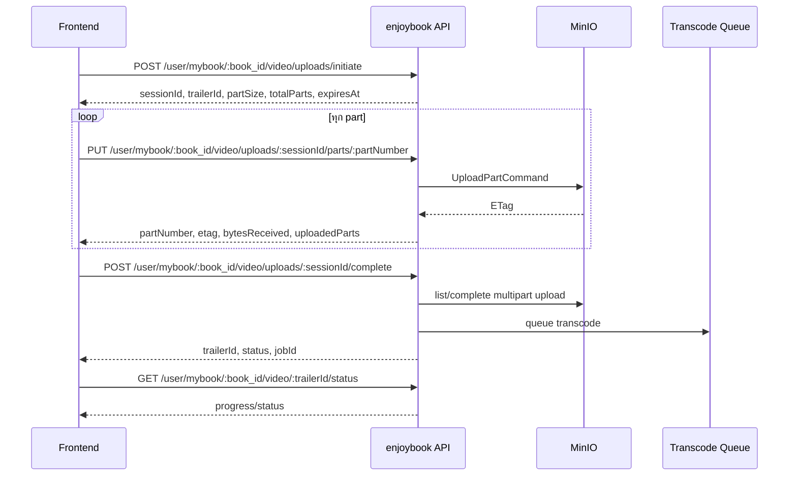

# Frontend Handoff: แก้อัปโหลดวิดีโอ Trailer ให้ผ่าน API

เอกสารนี้สรุปสิ่งที่หน้าบ้านต้องแก้หลัง backend เปลี่ยนจากอัปโหลดตรงเข้า MinIO ด้วย presigned URL เป็นอัปโหลด binary part ผ่าน API โดยตรง

## สารบัญ

1. [สรุปภาพรวม (TL;DR)](#สรุปภาพรวม-tldr)
2. [สิ่งที่ต้องเลิกใช้จาก flow เดิม](#สิ่งที่ต้องเลิกใช้จาก-flow-เดิม)
3. [Flow ใหม่ที่ frontend ต้องทำ](#flow-ใหม่ที่-frontend-ต้องทำ)
4. [API ที่ต้องเรียก](#api-ที่ต้องเรียก)
5. [ตัวอย่าง client implementation](#ตัวอย่าง-client-implementation)
6. [UI state และ progress](#ui-state-และ-progress)
7. [Error handling ที่ต้องรองรับ](#error-handling-ที่ต้องรองรับ)
8. [Checklist สำหรับแก้หน้าบ้าน](#checklist-สำหรับแก้หน้าบ้าน)
9. [ข้อควรระวัง / ต้องตรวจสอบเพิ่ม](#ข้อควรระวัง--ต้องตรวจสอบเพิ่ม)

## สรุปภาพรวม (TL;DR)

| หัวข้อ | รายละเอียด |
|---|---|
| เปลี่ยนหลัก | จาก `POST parts` เพื่อขอ presigned URL แล้ว `PUT` ไป MinIO โดยตรง เป็น `PUT binary` เข้า API |
| endpoint หลักของ writer | `/user/mybook/:book_id/video/uploads/...` |
| endpoint ที่ถูกยกเลิก | `/parts/:partNumber/confirm` |
| สิ่งที่ frontend ไม่ต้องทำแล้ว | ไม่ต้องเก็บ presigned URL, ไม่ต้องอ่าน ETag จาก MinIO response header, ไม่ต้องเรียก confirm part |
| สิ่งที่ frontend ต้องทำแทน | slice ไฟล์เป็น part แล้ว `PUT` แต่ละ part เข้า API พร้อม `Authorization`, `Content-Type`, `Content-Length` |
| `complete` | เรียกได้ด้วย body ว่าง `{}` หรือไม่ส่ง `parts` ก็ได้ เพราะ backend ใช้ parts ที่บันทึกจาก API upload |
| part size | ใช้ `partSize` และ `totalParts` จาก response ของ initiate |
| format ที่รับ | `.mp4`, `.mov`, `.m4v`, `.webm` พร้อม MIME ที่ตรงกัน |

## สิ่งที่ต้องเลิกใช้จาก flow เดิม

ให้ลบ logic เดิมต่อไปนี้ออกจาก frontend:

- ห้ามเรียก `POST /video/trailers/uploads/:sessionId/parts/:partNumber` หรือ `/user/mybook/:book_id/video/uploads/:sessionId/parts/:partNumber` เพื่อขอ upload URL
- ห้าม `PUT` ไฟล์ไปยัง MinIO/presigned URL โดยตรง
- ห้ามอ่าน `ETag` จาก response header ของ MinIO เพื่อส่งกลับ backend
- ห้ามเรียก `POST .../parts/:partNumber/confirm`
- ห้ามปล่อย request อัปโหลด part โดยไม่มี JWT เพราะทุก part ต้องผ่าน API และต้องมี `Authorization`

## Flow ใหม่ที่ frontend ต้องทำ



## API ที่ต้องเรียก

### Writer upload endpoints

ใช้สำหรับหน้าเขียนนิยาย/จัดการหนังสือของเจ้าของผลงาน

| Method | Path | Auth | หน้าที่ |
|---|---|---|---|
| `POST` | `/user/mybook/:book_id/video/uploads/initiate` | JWT | เปิด upload session |
| `GET` | `/user/mybook/:book_id/video/uploads/:sessionId` | JWT | ดูสถานะ upload และ part ที่อัปแล้ว |
| `PUT` | `/user/mybook/:book_id/video/uploads/:sessionId/parts/:partNumber` | JWT | อัปโหลด binary part ผ่าน API |
| `POST` | `/user/mybook/:book_id/video/uploads/:sessionId/complete` | JWT | จบ multipart upload และเข้า queue transcode |
| `DELETE` | `/user/mybook/:book_id/video/uploads/:sessionId` | JWT | ยกเลิก upload |
| `GET` | `/user/mybook/:book_id/video/:trailerId/status` | JWT | poll สถานะ transcode |

### `POST /user/mybook/:book_id/video/uploads/initiate`

Request JSON:

| Field | จำเป็น | ความหมาย |
|---|---:|---|
| `fileName` | yes | ชื่อไฟล์จริง เช่น `trailer.mp4` |
| `fileSize` | yes | ขนาดไฟล์ byte จาก `file.size` |
| `mimeType` | yes | MIME จาก `file.type` |

ตัวอย่าง:

```json
{
  "fileName": "trailer.mp4",
  "fileSize": 73400320,
  "mimeType": "video/mp4"
}
```

Response สำคัญ:

| Field | ใช้ทำอะไร |
|---|---|
| `sessionId` | ใช้กับ upload/status/complete/abort |
| `trailerId` | ใช้ poll transcode status |
| `partSize` | ใช้ slice ไฟล์แต่ละ part |
| `totalParts` | จำนวนรอบที่ต้อง upload |
| `expiresAt` | แสดงเวลาหมดอายุ session หรือใช้เตือนให้เริ่มใหม่ |

### `PUT /user/mybook/:book_id/video/uploads/:sessionId/parts/:partNumber`

ส่ง binary body ของ part นั้นเข้า API โดยตรง

Headers ที่ต้องมี:

| Header | ค่า |
|---|---|
| `Authorization` | JWT เดิมของระบบ |
| `Content-Type` | `application/octet-stream` |
| `Content-Length` | จำนวน byte ของ part นี้ ต้องตรงกับขนาด slice |

กติกาขนาด part:

- part ที่ไม่ใช่ part สุดท้ายต้องมีขนาดเท่ากับ `partSize`
- part สุดท้ายต้องมีขนาดเท่ากับ `fileSize - partSize * (totalParts - 1)`
- ถ้า `Content-Length` ไม่ตรง backend จะคืน `VIDEO_UPLOAD_PART_SIZE_MISMATCH`

Response สำคัญ:

| Field | ใช้ทำอะไร |
|---|---|
| `partNumber` | part ที่ upload สำเร็จ |
| `etag` | ETag จาก MinIO ที่ backend บันทึกแล้ว ใช้แสดง/debug ได้ แต่ไม่ต้องส่ง confirm |
| `bytesReceived` | จำนวน byte ที่ API รับ |
| `uploadedParts` | จำนวน part ที่ backend บันทึกแล้ว |

### `POST /user/mybook/:book_id/video/uploads/:sessionId/complete`

เรียกเมื่อ upload ครบทุก part แล้ว

Request body:

```json
{}
```

หมายเหตุ: schema ยังรับ `parts` ได้ แต่ frontend ใหม่ไม่ควรส่ง ETag list เอง เพราะ backend ใช้ ETag ที่ได้จาก API upload เป็นแหล่งข้อมูลหลัก

Response สำคัญ:

| Field | ใช้ทำอะไร |
|---|---|
| `trailerId` | ใช้ poll status |
| `status` | ปกติจะไปต่อเป็น `queued` หรือสถานะ recovery |
| `jobId` | ใช้อ้างอิงงาน transcode ได้ถ้าหน้าบ้านต้องแสดง |

## ตัวอย่าง client implementation

ตัวอย่างนี้เป็นแนวทาง ไม่ผูกกับ framework ใด framework หนึ่ง

```ts
async function uploadTrailer({
  apiBaseUrl,
  token,
  bookId,
  file,
  onProgress,
}: {
  apiBaseUrl: string;
  token: string;
  bookId: string | number;
  file: File;
  onProgress?: (progress: { uploadedParts: number; totalParts: number; percent: number }) => void;
}) {
  const initRes = await fetch(
    `${apiBaseUrl}/user/mybook/${bookId}/video/uploads/initiate`,
    {
      method: "POST",
      headers: {
        Authorization: token,
        "Content-Type": "application/json",
      },
      body: JSON.stringify({
        fileName: file.name,
        fileSize: file.size,
        mimeType: file.type,
      }),
    },
  );

  if (!initRes.ok) throw await initRes.json();
  const initJson = await initRes.json();
  const upload = initJson.data;

  for (let partNumber = 1; partNumber <= upload.totalParts; partNumber += 1) {
    const start = (partNumber - 1) * upload.partSize;
    const end = Math.min(file.size, start + upload.partSize);
    const blob = file.slice(start, end);

    const partRes = await fetch(
      `${apiBaseUrl}/user/mybook/${bookId}/video/uploads/${upload.sessionId}/parts/${partNumber}`,
      {
        method: "PUT",
        headers: {
          Authorization: token,
          "Content-Type": "application/octet-stream",
          "Content-Length": String(blob.size),
        },
        body: blob,
      },
    );

    if (!partRes.ok) throw await partRes.json();

    onProgress?.({
      uploadedParts: partNumber,
      totalParts: upload.totalParts,
      percent: Math.floor((partNumber / upload.totalParts) * 100),
    });
  }

  const completeRes = await fetch(
    `${apiBaseUrl}/user/mybook/${bookId}/video/uploads/${upload.sessionId}/complete`,
    {
      method: "POST",
      headers: {
        Authorization: token,
        "Content-Type": "application/json",
      },
      body: JSON.stringify({}),
    },
  );

  if (!completeRes.ok) throw await completeRes.json();
  return completeRes.json();
}
```

ข้อควรระวังของตัวอย่าง:

- Browser บางตัวหรือบาง adapter อาจไม่ยอมให้ set `Content-Length` เอง เพราะเป็น forbidden header ใน Fetch API
- ถ้า browser ไม่ส่ง `Content-Length` ให้ backend จะคืน `VIDEO_UPLOAD_CONTENT_LENGTH_REQUIRED`
- ต้องตรวจสอบกับ frontend runtime จริง ถ้า set ไม่ได้ อาจต้องใช้ HTTP client/runtime ที่ส่ง `Content-Length` ให้เอง หรือปรับ backend contract เพิ่ม

## UI state และ progress

frontend ควรแยก progress เป็น 2 ช่วง:

| ช่วง | วิธีคิด progress |
|---|---|
| Upload | นับจำนวน part ที่ `PUT` สำเร็จ / `totalParts` |
| Transcode | poll `GET /user/mybook/:book_id/video/:trailerId/status` หลัง complete |

สถานะที่ควรแสดง:

- `initiating`: กำลังสร้าง session
- `uploading`: กำลัง PUT part ผ่าน API
- `completing`: เรียก complete แล้ว รอ backend verify multipart
- `queued`: upload จบแล้ว รอ transcode
- `processing`: กำลัง transcode
- `completed`: พร้อมใช้งาน
- `failed`: transcode หรือ upload flow ล้มเหลว
- `cancelled` / `expired`: session ใช้ต่อไม่ได้ ต้องเริ่มใหม่

## Error handling ที่ต้องรองรับ

| Error | HTTP | เกิดเมื่อ | วิธีจัดการหน้าบ้าน |
|---|---:|---|---|
| `UNAUTHORIZED` | 401 | ไม่มีหรือ JWT ใช้ไม่ได้ | ให้ login ใหม่หรือ refresh auth |
| `BOOK_NOT_FOUND_OR_PERMISSION_DENIED` | 403 | user ไม่ใช่เจ้าของหนังสือ | แสดงว่าไม่มีสิทธิ์จัดการวิดีโอ |
| `VIDEO_MANAGEMENT_PERMISSION_DENIED` | 403 | writer ยังไม่มีสิทธิ์จัดการวิดีโอ | ปิดปุ่ม upload หรือแสดงข้อความขอสิทธิ์ |
| `VIDEO_FILE_EXTENSION_NOT_ALLOWED` | 400 | นามสกุลไม่ใช่ `.mp4`, `.mov`, `.m4v`, `.webm` | block ก่อน upload |
| `VIDEO_MIME_TYPE_NOT_ALLOWED` | 400 | MIME ไม่อยู่ในรายการที่รองรับ | block ก่อน upload |
| `VIDEO_FILE_TYPE_MISMATCH` | 400 | นามสกุลกับ MIME ไม่ตรงกัน | ให้เลือกไฟล์ใหม่ |
| `VIDEO_FILE_SIZE_LIMIT_EXCEEDED` | 400 | ไฟล์ใหญ่เกิน config backend | แสดง limit จาก config ถ้ามีใน UI |
| `VIDEO_UPLOAD_CONTENT_LENGTH_REQUIRED` | 400 | PUT part ไม่มี `Content-Length` | ตรวจ HTTP client/runtime |
| `VIDEO_UPLOAD_CONTENT_LENGTH_INVALID` | 400 | `Content-Length` ไม่ใช่จำนวนเต็มบวก | ตรวจ header ก่อนส่ง |
| `VIDEO_UPLOAD_BODY_MISSING` | 400 | PUT part ไม่มี body | ตรวจ `Blob/File.slice` |
| `VIDEO_UPLOAD_PART_NUMBER_INVALID` | 400 | partNumber นอกช่วง `1..totalParts` | แก้ loop upload |
| `VIDEO_UPLOAD_PART_SIZE_MISMATCH` | 400 | ขนาด part ไม่ตรงกับ backend คาดไว้ | คำนวณ slice ใหม่จาก `partSize` |
| `VIDEO_UPLOAD_SESSION_EXPIRED` | 409 | session หมดอายุ | เริ่ม upload ใหม่ |
| `VIDEO_UPLOAD_SESSION_NOT_ACTIVE` | 409 | session ถูก complete/abort/expired แล้ว | reload status หรือเริ่มใหม่ |
| `VIDEO_UPLOAD_PARTS_INCOMPLETE` | 409 | complete ก่อน upload ครบ | ตรวจ uploaded parts ก่อน complete |
| `VIDEO_UPLOAD_SIZE_MISMATCH` | 409 | backend ตรวจขนาดรวมแล้วไม่ตรง | ให้เริ่ม upload ใหม่ |
| `VIDEO_UPLOAD_ALREADY_IN_PROGRESS` | 409 | หนังสือมี upload ค้างอยู่ | แสดง pending session หรือให้ abort ก่อน |
| `VIDEO_SERVICE_UNAVAILABLE` | 503 | MinIO/Redis/queue ไม่พร้อม | ให้ retry ภายหลัง |

## Checklist สำหรับแก้หน้าบ้าน

- [ ] ลบ flow ขอ presigned URL เดิม
- [ ] ลบ call `/confirm`
- [ ] เปลี่ยน part upload เป็น `PUT /user/mybook/:book_id/video/uploads/:sessionId/parts/:partNumber`
- [ ] ส่ง JWT ทุก request รวมถึงทุก part
- [ ] ส่ง `Content-Type: application/octet-stream` ตอน upload part
- [ ] ตรวจว่า runtime ส่ง `Content-Length` ได้จริง
- [ ] ใช้ `partSize` จาก initiate response เท่านั้น ห้าม hardcode เอง
- [ ] คำนวณ part สุดท้ายจาก `file.size`
- [ ] complete ด้วย `{}` หลัง upload ครบทุก part
- [ ] แยก progress upload กับ transcode
- [ ] รองรับ retry ราย part โดยเรียก `PUT` part เดิมซ้ำได้
- [ ] ถ้า user กดยกเลิก ให้เรียก `DELETE /user/mybook/:book_id/video/uploads/:sessionId`
- [ ] ถ้า refresh หน้า ให้เรียก `GET /user/mybook/:book_id/video/uploads/:sessionId` เพื่อ resume/แสดง uploaded parts
- [ ] block file type ฝั่ง client ให้ตรงกับ backend: `.mp4`, `.mov`, `.m4v`, `.webm`

## ข้อควรระวัง / ต้องตรวจสอบเพิ่ม

- ต้องทดสอบ `Content-Length` กับ browser/runtime จริง เพราะ Fetch API บน browser อาจไม่อนุญาตให้ set header นี้เอง
- ถ้า runtime ไม่ส่ง `Content-Length` ให้เอง ต้องแจ้ง backend เพื่อปรับ contract หรือเพิ่ม upload endpoint แบบที่รองรับ chunked transfer พร้อม byte counter
- ขนาด default จาก backend คือ `VIDEO_UPLOAD_PART_MB` หรือ fallback 20 MB ต่อ part และ `VIDEO_MAX_UPLOAD_MB` fallback 500 MB
- session หมดอายุ default 24 ชั่วโมงจาก `VIDEO_UPLOAD_SESSION_TTL_HOURS`
- API มี rate limit ตาม `VIDEO_UPLOAD_RATE_LIMIT_PER_MINUTE` fallback 240 request/minute
- หลัง backend upload ผ่าน API แล้ว MinIO ไม่ควรเปิด public upload ingress ให้ frontend ใช้งานอีก

## Implementation map

| ส่วน | ไฟล์ backend |
|---|---|
| Writer routes | `src/routes/user/mybook.route.ts` |
| Writer controller | `src/controllers/user/mybook.controller.ts` |
| Writer service wrapper | `src/services/user/mybook.service.ts` |
| Video upload service | `src/services/video/video_trailer.service.ts` |
| MinIO multipart upload | `src/lib/video_storage.ts` |
| Request schema | `src/schemas/video/video_trailer.schema.ts` |
| Error mapping | `src/controllers/video/video_error_response.ts` |
| Config | `src/config/video.config.ts` |
