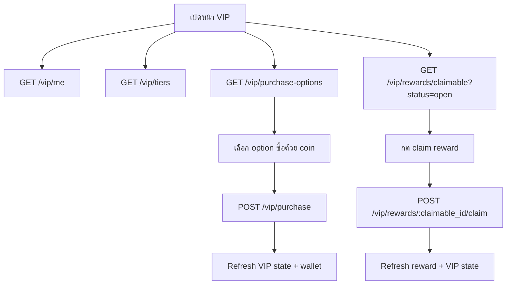

# VIP Membership - Frontend

เอกสารนี้อธิบายการทำงานฝั่งหน้าบ้านสำหรับฟีเจอร์ VIP Membership ของ `enjoybook_web_api` โดยอ้างอิง contract จาก backend ปัจจุบัน

## สารบัญ

- [TL;DR](#tldr)
- [หน้าที่ของ Frontend](#หน้าที่ของ-frontend)
- [หน้าจอที่ควรมี](#หน้าจอที่ควรมี)
- [Flow หลัก](#flow-หลัก)
- [API Contract](#api-contract)
- [State Model](#state-model)
- [Purchase UX](#purchase-ux)
- [Reward UX](#reward-ux)
- [Profile และ Time Pass](#profile-และ-time-pass)
- [Error UX](#error-ux)
- [Checklist ก่อนส่งงาน](#checklist-ก่อนส่งงาน)

## TL;DR

| หัวข้อ | รายละเอียด |
|---|---|
| Source of truth | Backend API ใน `src/routes/vip/vip.route.ts` |
| หน้าแรกที่ควรโหลด | `/vip/me`, `/vip/tiers`, `/vip/purchase-options`, `/vip/rewards/claimable?status=open` |
| ซื้อ VIP | ใช้ `POST /vip/purchase` ด้วย `currency_type: "coin"` เท่านั้น |
| ห้าม frontend คำนวณราคาเอง | ใช้ราคาจาก `/vip/purchase-options` |
| Reward | อ่านจาก `/vip/rewards/claimable` และ claim ผ่าน `/vip/rewards/:claimable_id/claim` |
| เติมเงินจริง | ไม่เรียกผ่านโปรเจคนี้ ให้ระบบเติมเงินเว็บจัดการเอง |
| หลัง action สำเร็จ | refresh `/vip/me`, `/vip/purchase-options`, `/vip/rewards/claimable` และ wallet balance |

## หน้าที่ของ Frontend

Frontend ควรทำหน้าที่เป็น presentation และ orchestration เท่านั้น:

- แสดง tier, VIP ปัจจุบัน, วันหมดอายุ, progress และ reward
- แสดงตัวเลือกซื้อจาก `/vip/purchase-options`
- ส่งคำสั่งซื้อด้วย coin ผ่าน `/vip/purchase`
- ส่งคำสั่ง claim reward ผ่าน `/vip/rewards/:claimable_id/claim`
- แสดง error ตาม `error_code` จาก backend
- refresh state หลัง purchase หรือ claim

สิ่งที่ frontend ไม่ควรทำ:

- ไม่คำนวณราคา upgrade/stack เอง
- ไม่สร้าง logic tier threshold เอง
- ไม่เรียก endpoint เติมเงินจริงใน `enjoybook_web_api`
- ไม่ assume ว่า reward claim ได้จากแค่ status ต้องใช้ `claimable_at` และผลจาก backend ด้วย

## หน้าจอที่ควรมี

| หน้าจอ/ส่วน | API ที่ใช้ | รายละเอียด |
|---|---|---|
| VIP overview | `GET /vip/me` | แสดง tier ปัจจุบัน, วันคงเหลือ, progress, reward summary |
| Tier list | `GET /vip/tiers` | แสดง benefit และ reward ของแต่ละ tier |
| Purchase panel | `GET /vip/purchase-options`, `POST /vip/purchase` | แสดง option ซื้อด้วย coin |
| Reward list | `GET /vip/rewards/claimable` | แสดง reward pending/claimable/claimed |
| History | `GET /vip/history` | แสดง timeline การซื้อ, upgrade, claim |
| Membership log | `GET /vip/membership-logs` | ใช้ในหน้า debug/admin/user activity ถ้าต้องการ |
| Profile badge | profile API ที่มี `vip_summary` | แสดง badge VIP ใน profile |
| Book detail early access | book detail API | แสดง `time_pass_discount_percent` และ window ที่ลดแล้ว |

## Flow หลัก



## API Contract

### GET `/vip/tiers`

ใช้สำหรับแสดง tier ทั้งหมดที่ active และ reward config ของแต่ละ tier

ข้อมูลหลักที่ frontend ควรใช้:

| Field | ใช้แสดง |
|---|---|
| `tier_code` | code เช่น `BRONZE`, `SILVER`, `GOLD` |
| `name_th`, `name_en` | ชื่อ tier |
| `step_required_amount_baht` | ยอดสะสมที่ต้องใช้สำหรับ tier |
| `duration_days` | อายุ membership |
| `stack_enabled` | tier นี้ต่ออายุแบบ stack ได้หรือไม่ |
| `stack_required_amount_baht` | ยอดที่ต้องใช้ในการ stack |
| `stack_duration_days` | จำนวนวันที่ได้จาก stack |
| `time_pass_discount_percent` | ส่วนลด Time Pass |
| `rewards` | benefit/reward ของ tier |

### GET `/vip/me`

ใช้เป็น state หลักของหน้า VIP

ข้อมูลหลัก:

| Field | ใช้แสดง |
|---|---|
| `server_time` | ใช้เทียบ countdown |
| `current_tier.tier_code` | badge tier ปัจจุบัน |
| `current_tier.valid_until` | วันหมดอายุ |
| `current_tier.days_remaining` | จำนวนวันคงเหลือ |
| `current_tier.time_pass_discount_percent` | สิทธิ์ Time Pass |
| `current_tier.live_chat_access` | สิทธิ์ live chat |
| `progress.next_tier` | tier ถัดไป |
| `progress.progress_amount_baht` | ยอดสะสมปัจจุบัน |
| `progress.remaining_amount_baht` | ยอดที่เหลือเพื่อไป tier ถัดไป |
| `progress.upgrade_options` | option upgrade จาก backend |
| `progress.stack_*` | ข้อมูล stack ถ้าอยู่ tier สูงสุด |
| `rewards.claimable_count` | จำนวน reward ที่ claim ได้ |
| `rewards.next_claimable_at` | เวลาที่ reward ถัดไป claim ได้ |
| `rewards.next_reward_previews` | preview reward ถัดไป |

ข้อควรทำ:

- ใช้ `server_time` จาก backend สำหรับ countdown เพื่อลดปัญหาเวลาเครื่อง user ไม่ตรง
- ถ้า `current_tier.is_paid_tier=false` ให้แสดงสถานะ free tier
- ถ้า `valid_until=null` ให้ไม่แสดง countdown แบบหมดอายุ

### GET `/vip/purchase-options`

ใช้เป็น source of truth สำหรับปุ่มซื้อ VIP ด้วย coin

ข้อมูล option ที่ควรใช้:

| Field | ใช้แสดง |
|---|---|
| `target_tier_code` | tier ที่จะซื้อ |
| `currency_type` | ปัจจุบันเป็น `coin` |
| `price` | จำนวน coin ที่ต้องจ่าย |
| `required_accumulated_amount_baht` | threshold รวม |
| `current_progress_amount_baht` | progress ตอนนี้ |
| `purchase_kind` | `upgrade` หรือ `tier_extend_stack` |
| `stack_duration_days` | จำนวนวันที่ได้เมื่อเป็น stack |
| `can_purchase` | ใช้เปิด/ปิดปุ่มซื้อ |

ข้อกำหนด:

- ห้าม frontend ใช้ tier config มาคำนวณ `price` เอง
- ถ้าไม่มี option ให้ซ่อนหรือ disable purchase panel
- ถ้า option เป็น `tier_extend_stack` ให้ wording เป็นต่ออายุ ไม่ใช่ upgrade

### POST `/vip/purchase`

ใช้ซื้อ VIP ด้วย coin

```json
{
  "target_tier_code": "GOLD",
  "currency_type": "coin",
  "idempotency_key": "vip-web-user-123-gold-20260624T100000"
}
```

คำแนะนำสำหรับ `idempotency_key`:

- สร้างต่อ action การกดซื้อหนึ่งครั้ง
- เก็บ key เดิมระหว่าง retry ของ request เดียวกัน
- อย่าสร้าง key ใหม่ตอน retry หลัง network timeout ทันที เพราะอาจทำให้ซื้อซ้ำได้

หลังซื้อสำเร็จควร refresh:

- `/vip/me`
- `/vip/purchase-options`
- `/vip/rewards/claimable?status=open`
- wallet/user balance endpoint ที่หน้าบ้านใช้อยู่

### GET `/vip/rewards/claimable`

Query:

| Query | ค่า |
|---|---|
| `page` | positive integer string |
| `limit` | positive integer string |
| `status` | `all`, `open`, `pending`, `claimable`, `claimed`, `expired`, `cancelled` |

คำแนะนำ:

- หน้า overview ใช้ `status=open` เพื่อรวม `pending` และ `claimable`
- หน้า history/reward archive ใช้ `all` หรือ filter ตาม tab
- reward ที่ `status=pending` ให้แสดง countdown จาก `claimable_at`
- reward ที่ `status=claimable` ให้เปิดปุ่ม claim
- reward ที่ `status=claimed`, `expired`, `cancelled` ให้ disable action

### POST `/vip/rewards/:claimable_id/claim`

ใช้ claim reward หนึ่งรายการ

หลัง claim สำเร็จควร refresh:

- reward list ปัจจุบัน
- `/vip/me` เพื่อ update `claimable_count` และ reward preview
- wallet/coupon inventory ถ้า reward ส่งผลกับยอดหรือ coupon

### GET `/vip/history`

ใช้แสดง timeline รวม membership transition และ reward claim

Query:

| Query | ค่า |
|---|---|
| `page` | positive integer string |
| `limit` | positive integer string |

เหมาะสำหรับหน้า activity หรือประวัติ VIP ของ user

### GET `/vip/membership-logs`

ใช้แสดง log เฉพาะ transition ของ membership เช่น activate, upgrade, stack, expire

## State Model

Frontend ควรแยก state อย่างน้อย 4 ก้อน:

| State | Source | Refresh เมื่อ |
|---|---|---|
| `vipMe` | `/vip/me` | เปิดหน้า, purchase สำเร็จ, claim สำเร็จ, user login |
| `tiers` | `/vip/tiers` | เปิดหน้า หรือ cache ตามรอบ deploy/config |
| `purchaseOptions` | `/vip/purchase-options` | เปิดหน้า, purchase สำเร็จ, wallet เปลี่ยน |
| `claimables` | `/vip/rewards/claimable` | เปิดหน้า, claim สำเร็จ, purchase/upgrade สำเร็จ |

สถานะ loading ที่ควรแยก:

- initial loading ของหน้า VIP
- loading เฉพาะปุ่ม purchase
- loading เฉพาะปุ่ม claim แต่ละ reward
- refreshing state หลัง action

## Purchase UX

ลำดับที่แนะนำ:

1. โหลด `/vip/purchase-options`
2. แสดง option ตาม `purchase_kind`
3. ก่อนซื้อ แสดง confirmation ที่มี tier, coin ที่ใช้, ผลลัพธ์โดยย่อ
4. สร้าง `idempotency_key`
5. disable ปุ่มระหว่าง request
6. ถ้าสำเร็จ ให้ refresh state และแสดงผลลัพธ์จาก response
7. ถ้า error ให้ map ตาม `error_code`

ข้อความควรแยกตามชนิด:

| `purchase_kind` | Wording |
|---|---|
| `upgrade` | อัปเกรดเป็น VIP tier เป้าหมาย |
| `tier_extend_stack` | ต่ออายุ VIP tier ปัจจุบัน |

ข้อควรระวัง:

- ถ้า response เป็น `idempotent: true` ให้ถือว่าสำเร็จจาก request เดิม และ refresh state
- ถ้าเจอ network timeout หลังส่ง purchase แล้ว ควร retry ด้วย `idempotency_key` เดิม
- ถ้าเจอ `VIP_CURRENCY_NOT_ENOUGH` ให้ refresh wallet balance และ purchase options

## Reward UX

รูปแบบการแสดงผล:

| Status | UX |
|---|---|
| `pending` | แสดงเวลาที่จะเปิด claim จาก `claimable_at` |
| `claimable` | เปิดปุ่ม claim |
| `claimed` | แสดงว่าได้รับแล้ว |
| `expired` | แสดงว่าหมดอายุ |
| `cancelled` | แสดงว่าถูกยกเลิกจาก transition เช่น upgrade |

หลัง claim:

- ปิดปุ่มระหว่าง request
- ถ้าสำเร็จ แสดงรายการ reward ที่ได้รับจาก response
- refresh claimables และ VIP summary
- ถ้า reward เป็น coupon ควร refresh coupon inventory หรือแจ้งให้ user ไปใช้ coupon ถ้าเต็ม

## Profile และ Time Pass

### Profile Badge

profile API มี `vip_summary` จาก `VipService.resolveVipSummaryForProfile(userId)`

Frontend สามารถใช้เพื่อ:

- แสดง badge tier ในหน้า profile
- แสดงวันหมดอายุแบบย่อ
- แสดงสิทธิ์สำคัญ เช่น live chat access หรือ time pass discount

### Book Detail / Time Pass

book detail service จะคำนวณผลของ VIP แล้วส่ง field ที่เกี่ยวข้องกับ early access เช่น:

- `time_pass_discount_percent`
- `base_window_days`
- `effective_window_days`

Frontend ควรใช้ค่าจาก response ของ book detail โดยตรง และไม่คำนวณ discount ซ้ำเอง

## Error UX

Backend ส่ง error หลักผ่าน `data.error_code`

| Error code | UX ที่แนะนำ |
|---|---|
| `VIP_DISABLED` | ซ่อนหน้า VIP หรือแสดงว่าระบบปิดชั่วคราว |
| `VIP_CURRENCY_PURCHASE_DISABLED` | disable purchase panel |
| `VIP_UNSUPPORTED_CURRENCY` | ถือเป็น client bug เพราะ frontend ควรส่ง `coin` เท่านั้น |
| `VIP_TARGET_TIER_NOT_FOUND` | refresh tiers/options |
| `VIP_TARGET_TIER_INVALID` | refresh options และไม่ให้ซื้อ option เดิม |
| `VIP_TARGET_TIER_NOT_UPGRADABLE` | refresh `/vip/me` และ `/vip/purchase-options` |
| `VIP_CURRENCY_NOT_ENOUGH` | แจ้ง coin ไม่พอและพาไปหน้าเติม coin ของเว็บ |
| `VIP_REWARD_CLAIM_DISABLED` | disable ปุ่ม claim |
| `VIP_REWARD_NOT_FOUND` | refresh reward list |
| `VIP_REWARD_ALREADY_CLAIMED` | refresh reward list และแสดงว่าได้รับแล้ว |
| `VIP_REWARD_EXPIRED` | refresh reward list และแสดงหมดอายุ |
| `VIP_REWARD_NOT_CLAIMABLE_YET` | แสดง countdown จาก `claimable_at` |
| `VIP_REWARD_COUPON_HOLDING_LIMIT_EXCEEDED` | แจ้งให้ user ใช้ coupon ที่ถืออยู่ก่อน |
| `VIP_INTERNAL_ERROR` | แสดง error กลางและให้ retry |

รูปแบบ response error:

```json
{
  "code": 400,
  "status": "error",
  "message": "VIP_CURRENCY_NOT_ENOUGH",
  "data": {
    "error_code": "VIP_CURRENCY_NOT_ENOUGH",
    "currency_type": "coin",
    "required_amount": 100
  }
}
```

## Checklist ก่อนส่งงาน

- ใช้ `/vip/purchase-options` เป็นแหล่งราคาและ target tier เท่านั้น
- ส่ง `currency_type: "coin"` ใน `/vip/purchase`
- ใช้ `idempotency_key` เดิมเมื่อ retry purchase เดิม
- refresh VIP state, purchase options, reward list และ wallet หลัง purchase สำเร็จ
- refresh reward list, VIP state และ inventory ที่เกี่ยวข้องหลัง claim สำเร็จ
- ใช้ `server_time` จาก `/vip/me` สำหรับ countdown
- แยก UX ของ `upgrade` กับ `tier_extend_stack`
- map `error_code` ครบสำหรับ purchase และ reward claim
- ไม่เรียก flow เติมเงินจริงผ่าน `enjoybook_web_api`
- ใช้ค่าที่ book detail ส่งมาโดยตรงสำหรับ Time Pass ไม่คำนวณซ้ำใน frontend
